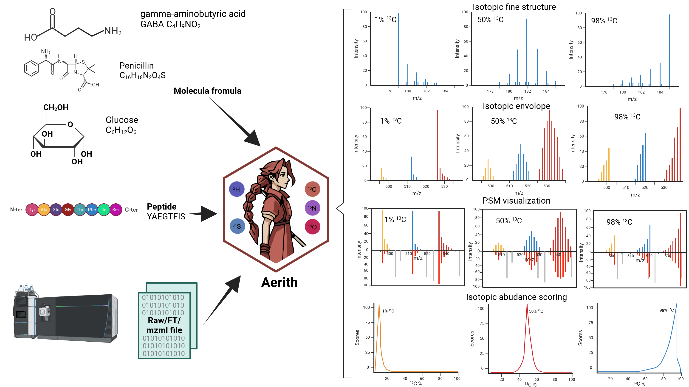
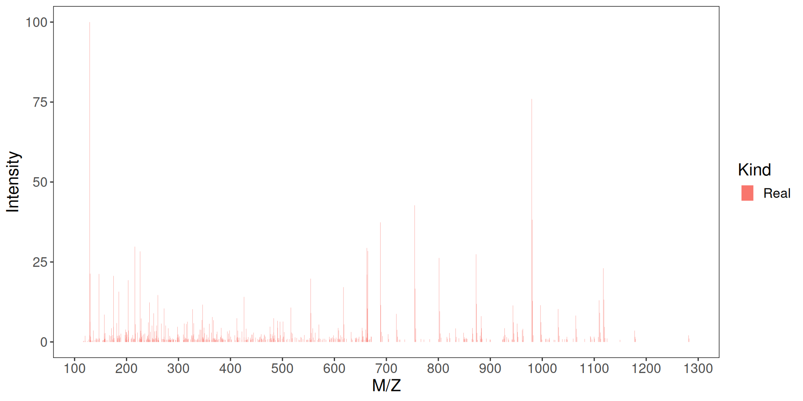
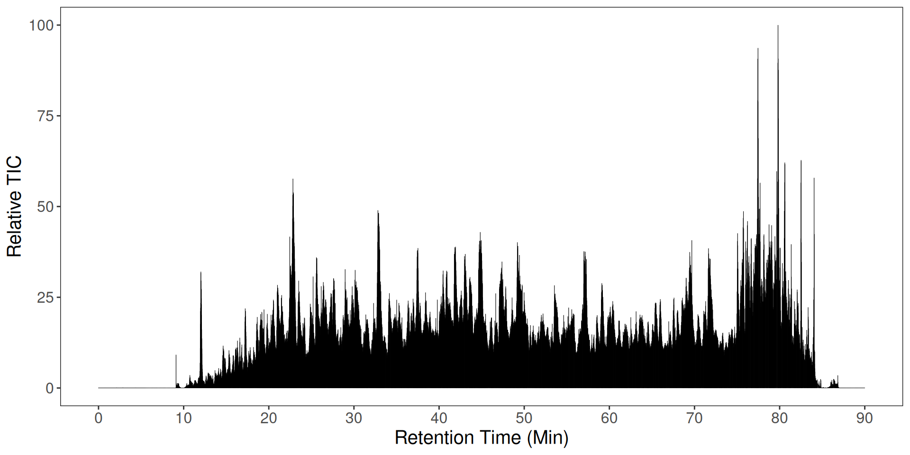
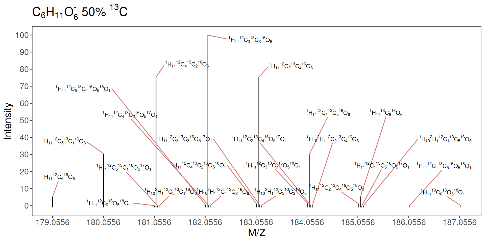
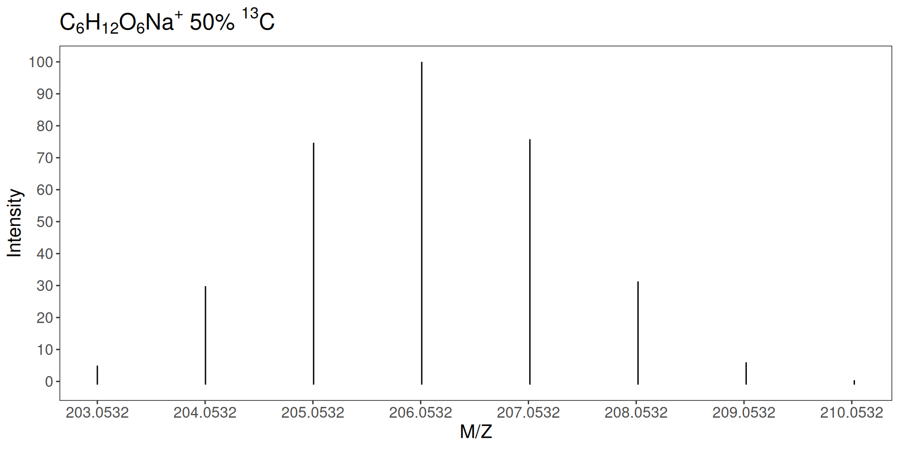
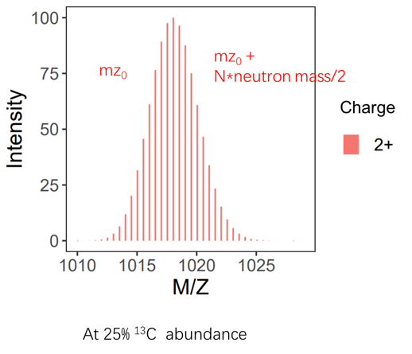
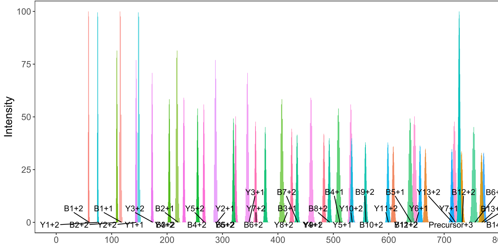
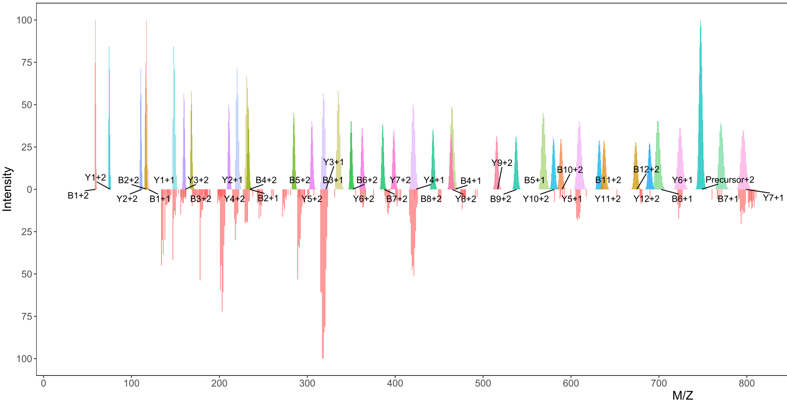

### Aerith 

Aerith is an R package that provides interfaces to read and write mass spectrum scans, calculate the theoretical isotopic peak envelope of peptide precursors and their B Y ions, score and visualize the PSM (peptide and spectra match), and visualize the TIC (total ion current) using Rcpp. In Final Fantasy VII, Aerith is the last surviving Cetra or “Ancient” who can communicate with the planet. In stable isotope analysis such as SIP (stable isotope probe), we study Earth or even the universe by analyzing isotopes of elements.



### Citation

Xiong, Yi, Ryan S. Mueller, Shichao Feng, Xuan Guo, and Chongle Pan. "Proteomic stable isotope probing with an upgraded Sipros algorithm for improved identification and quantification of isotopically labeled proteins." Microbiome 12 (2024).

### Install

You can download the source package in release to install or install from github directly by following code in R.

```r
library(devtools)
install_github("xyz1396/Aerith")
library(Aerith)
```

### Download the test files

Please read the [vignettes](./vignettes/) to get the input files and detail tutorial.

#### Convert raw file to FT1, FT2, and mzml file

[Link to download Raxport and help pages](https://github.com/xyz1396/Raxport.net)  
[Links to download ThermoRawFileParser](https://github.com/compomics/ThermoRawFileParser/)  
[Links of tutorial of Sipros](https://github.com/thepanlab/Sipros4)  
[conda env of Sipros](https://anaconda.org/bioconda/sipros)  

```{bash, eval=FALSE}
mkdir rmd
mkdir "rmd/input data format"
cd "rmd/input data format"
wget https://github.com/xyz1396/Raxport.net/releases/download/Raxport5.02/Raxport
chmod +x Raxport
wget https://github.com/compomics/ThermoRawFileParser/releases/download/v1.4.5/ThermoRawFileParser1.4.5.zip
unzip ThermoRawFileParser1.4.5.zip -d ThermoRawFileParser
mkdir raw ft mzml mgf
conda create -n sipros4 -c bioconda -c conda-forge sipros
# for using mono in this conda env
conda activate sipros4
# Download raw file with 1% 13C
wget ftp://ftp.pride.ebi.ac.uk/pride/data/archive/2024/06/PXD041414/Pan_062822_X1iso5.raw -P raw
# Download raw file with 50% 13C  
wget ftp://ftp.pride.ebi.ac.uk/pride/data/archive/2024/06/PXD041414/Pan_052322_X13.raw -P raw
wget ftp://ftp.pride.ebi.ac.uk/pride/data/archive/2024/06/PXD041414/pct50.psm.txt
wget ftp://ftp.pride.ebi.ac.uk/pride/data/archive/2024/06/PXD041414/pct1.psm.txt
# convert raw to FT1 and FT2 file
./Raxport -i raw -o ft -j 8
# convert raw to mzml file
mono ThermoRawFileParser/ThermoRawFileParser.exe -d raw -o mzml
mono ThermoRawFileParser/ThermoRawFileParser.exe -d raw -f 0 -o mgf
```

### Read and write Mass spectrum scan

#### Read all scans from FT1 and FT2 file

```{r eval=FALSE}
ft2 <- readAllScanMS2("../rmd/input data format/ft/Pan_062822_X1iso5.FT2")
ft2 <- getRealScan(10487, ft2)
plot(ft2)

ft1 <- readAllScanMS1("../rmd/input data format/ft/Pan_062822_X1iso5.FT1")
tic <- getTIC(ft1)
ft1 <- getRealScan(10430, ft1)
plot(ft1)
```



```{r eval=FALSE}
plotTIC(tic)
```



#### Write small demo FT1 FT2 file

```{r eval=FALSE}
header <- readFTheader("../rmd/input data format/ft/Pan_062822_X1iso5.FT1")
ft1 <- readAllScanMS1("../rmd/input data format/ft/Pan_062822_X1iso5.FT1")
writeAllScanMS1(header,ft1[1:100],"../rmd/input data format/demo.ft1")
```

```{r eval=FALSE}
header <- readFTheader("../rmd/input data format/ft/Pan_062822_X1iso5.FT2")
ft2 <- readAllScanMS2("../rmd/input data format/ft/Pan_062822_X1iso5.FT2")
writeAllScanMS2(header,ft2[1:100],"../rmd/input data format/demo.ft2")
```

### Theoretic spectra generation of SIP labeled compound

```{r}
# natural abundance of (M-H)- of glucose
iso1<- cal_isotope_numbers_SIP("C6H11O6")
plotMolecularIsotopes(iso1) + 
  ggtitle(expression(C[6]*H[11]*O[6]^"-"~1.07*"% "*{}^{13}*C))
# adjusted abundance in SIP
iso2<- cal_isotope_numbers_SIP("C6H11O6", num_simulations = 50000, C13 = 0.5)
plotMolecularIsotopes(iso2) + 
  ggtitle(expression(C[6]*H[11]*O[6]^"-"~50*"% "*{}^{13}*C))
```



```{r}
# natural abundance of (M+Na)⁺ of glucose
iso1<- cal_isotope_peaks_fft("C6H12O6Na")
plotMolecularFFTisotopes(iso1) + 
  ggtitle(expression(C[6]*H[12]*O[6]*Na^"+"~1.07*"% "*{}^{13}*C))
# adjusted abundance in SIP
iso2<- cal_isotope_peaks_fft("C6H12O6Na", N_width = 200, min_abundance = 0.001, C13 = 0.5)
plotMolecularFFTisotopes(iso2) + 
  ggtitle(expression(C[6]*H[12]*O[6]*Na^"+"~50*"% "*{}^{13}*C))
```



### Calculate theorotic peak

#### Precursor

```r
a <- getSipPrecursorSpectra("KHRIPCDRK", "C13", 0.25, 2)
plot(a)
```



#### B Y ions

```r
a <- getSipBYionSpectra("KHRIPCDRK", "C13", 0.25, 1:2, 2)
plot(a)
```



### PSM visualization

```{r}
psm <- readPSMtsv("../rmd/input data format/pct50.psm.txt")
psm <- arrange(psm, desc(Score))
# use the same peptide as 1% 13C chunk
psm1 <- psm[4, ]
pep <- psm1$OriginalPeptide
pep <- str_sub(pep, 2, -2)
pct <- psm1$SearchName
pct <- as.numeric(str_sub(pct, 5, -4)) / 1000 / 100
scan1 <- readOneScanMS2("../rmd/input data format/ft/Pan_052322_X13.FT2", psm1$ScanNumber)
scan1 <- getRealScanFromList(scan1)
```

```{r}
isoCenter <- psm1$MeasuredParentMass / psm1$ParentCharge + 1.007276
anno <- annotatePSM(
  scan1@spectra$MZ, scan1@spectra$Prob,
  scan1@spectra$Charge,
  pep, 1:2, "C13",
  pct, isoCenter, 5.0
)
head(anno$ExpectedBYions[anno$ExpectedBYions$residuePositions != -1, ])
residuePos <- anno$ExpectedBYions$residuePositions[anno$ExpectedBYions$matchedIndices != -1]
table(residuePos)
# let the color be repeatable
set.seed(9527)
plotPSMannotation(
  observedSpect = scan1,
  pep = pep, Atom = "C13", Prob = pct,
  charges = c(1, 2), isoCenter = isoCenter,
  isoWidth = 5, ifRemoveNotFoundIon = T
)
```


