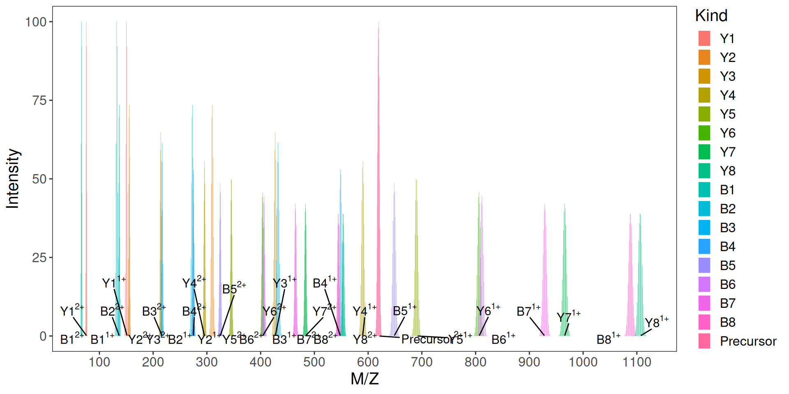
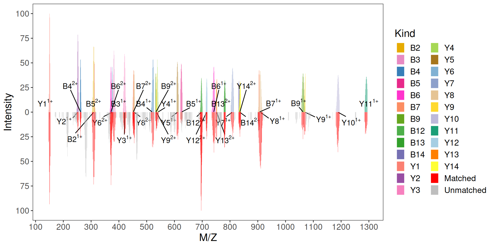

### Aerith


Aerith is an R package that provides interfaces to read and write mass spectrum scans, calculate the theoretical isotopic peak envelope of peptide precursors and their B Y ions, score and visualize the PSM (peptide and spectra match), and visualize the TIC (total ion current) using Rcpp. In Final Fantasy VII, Aerith is the last surviving Cetra or “Ancient” who can communicate with the planet. In stable isotope analysis such as SIP (stable isotope probe), we study Earth or even the universe by analyzing isotopes of elements.

### Install 

You can download the source package in release to install or install from github directly by following code in R. 

```r
library(devtools)
install_github("xyz1396/Aerith")
library(Aerith)
```

### Read and write Mass spectrum scan

Now we only support read .FT1 or .FT2 files well generated by [Raxport.net](https://github.com/xyz1396/Raxport.net)

Read .FT1 file 

```r
ft1 <- readAllScanMS1("demo.FT1")
```

Read .FT2 file 

```r
ft2 <- readAllScanMS2("demo.FT2")
```

Read .mzML file. You need to install mzR first

```r
ft1 <- readMzmlMS1("demo.mzML")
ft2 <- readMzmlMS2("demo.mzML")
```

Write .FT2 file

```r
header <- readFTheader("demo.ft2")
ft2 <- readAllScanMS2("demo.ft2")
writeAllScanMS2(header,ft2[1:10],"demo10.ft2")
```

### Calculate theorotic peak

#### Precursor

```r
a <- getSipPrecursorSpectra("KHRIPCDRK", "C13", 0.25, 2)
plot(a)
```


#### B Y ions

```r
a <- getSipBYionSpectra("KHRIPCDRK", "C13", 0.25, 1:2, 2)
plot(a)
```



### PSM visualization

```r
a <- getSipBYionSpectra("KHRIPCDRK", "C13", 0.25, 1:2)
p <- plot(a)
p <- p + plotSipBYionLabel(a)
b <- readAllScanMS2("demo.FT2")
c <- getRealScan(18, b)
p <- p + plotRealScan(c)
p
```




### TIC visualization

```r
a <- readAllScanMS2("demo.FT2")
b <- getTIC(a)
plotTIC(b)
```

